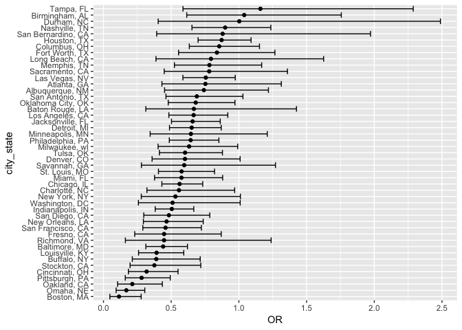

p8105\_hw6
================
Divya Bisht
11/24/2018

Problem 1
=========

``` r
homicide_wp = 
  read_csv(
    "https://raw.githubusercontent.com/washingtonpost/data-homicides/master/homicide-data.csv") %>%
  janitor::clean_names() %>% 
  mutate(city_state = str_c(city, state, sep = ", ")) %>%
  mutate(solved = as.numeric(disposition == "Closed by arrest"), 
         victim_age = as.numeric(victim_age)) %>%  
  filter(!city_state == "Dallas, TX", !city_state == "Phoenix, AZ", 
         !city_state == "Kansas City, MO", !city_state == "Tulsa, AL") %>% 
  
  mutate(victim_race = ifelse(victim_race == "White", "Non-White", "White"),
                            fct_relevel(victim_race, "Non-White", "White"))
```

    ## Parsed with column specification:
    ## cols(
    ##   uid = col_character(),
    ##   reported_date = col_integer(),
    ##   victim_last = col_character(),
    ##   victim_first = col_character(),
    ##   victim_race = col_character(),
    ##   victim_age = col_character(),
    ##   victim_sex = col_character(),
    ##   city = col_character(),
    ##   state = col_character(),
    ##   lat = col_double(),
    ##   lon = col_double(),
    ##   disposition = col_character()
    ## )

    ## Warning in evalq(as.numeric(victim_age), <environment>): NAs introduced by
    ## coercion

Baltimore only

``` r
baltimore_homicide = 
  homicide_wp %>%
  filter(city == "Baltimore") %>% 
  select(solved, victim_age, victim_race, victim_sex)
```

``` r
baltimore_logistic = 
  glm(solved ~ victim_age + victim_sex + victim_race, 
    data = baltimore_homicide, 
    family = binomial())
```

``` r
baltimore_logistic %>% 
  broom::tidy() %>% 
  mutate(OR = exp(estimate), 
        conf.low = exp(estimate - 1.96*std.error),
        conf.high = exp(estimate + 1.96*std.error)) %>%
  filter(term == "victim_raceWhite") %>%       
  knitr::kable(digits = 3)
```

| term              |  estimate|  std.error|  statistic|  p.value|     OR|  conf.low|  conf.high|
|:------------------|---------:|----------:|----------:|--------:|------:|---------:|----------:|
| victim\_raceWhite |     -0.82|      0.175|     -4.694|        0|  0.441|     0.313|       0.62|

GLM for each city

``` r
  homicide_wp %>% 
  group_by(city_state) %>% 
  nest() %>%
  mutate(model = map(data, ~glm(solved ~ victim_age + victim_sex + victim_race, 
    data = ., family = binomial()))) %>% 
  mutate(model = map(model, broom::tidy)) %>% 
  select(-data) %>% 
  unnest() %>%
  mutate(OR = exp(estimate), 
        conf.low = exp(estimate - 1.96*std.error),
        conf.high = exp(estimate + 1.96*std.error)) %>% 
  filter(term == "victim_raceWhite") %>%       
  

  ggplot(aes(x = city_state, y = OR), color = OR) +
    geom_point() +
  geom_errorbar(aes(ymin = conf.low, ymax = conf.high)) +
  coord_flip()
```



Problem 2
---------

``` r
birth_data = read_csv("./birthweight.csv") %>% 
    janitor::clean_names() %>%
    mutate(babysex = as.factor(babysex), mrace = as.factor(mrace), frace = as.factor(frace))
```

    ## Parsed with column specification:
    ## cols(
    ##   .default = col_integer(),
    ##   gaweeks = col_double(),
    ##   ppbmi = col_double(),
    ##   smoken = col_double()
    ## )

    ## See spec(...) for full column specifications.

Looking at bwt:

``` r
birth_data %>% 
  ggplot(aes(x = ppbmi, y = bwt)) +  
         geom_point() + 
         theme_bw()
```


Model

``` r
fit = lm(bwt ~ ppbmi + delwt + smoken, data = birth_data)
```

``` r
birth_data %>% 
  add_predictions(fit) %>% 
  add_residuals(fit) %>% 
  ggplot(aes(x = pred, y = resid)) + 
  geom_point()
```


``` r
cv_df = 
  crossv_mc(birth_data, 100) 
```

Two more models:

``` r
cv_df = 
  cv_df %>% 
  mutate(lin_mod = map(train, ~lm(bwt ~ ppbmi + delwt + smoken, data = .)),
         birth_length = map(train, ~lm(bwt ~ blength + gaweeks, data = .)),
         head_circ = map(train, ~lm(bwt ~ bhead + blength + babysex + bhead*blength + bhead*babysex + blength*babysex, data = .))) %>% 
  mutate(rmse_lin = map2_dbl(lin_mod, test, ~rmse(model = .x, data = .y)),
         rmse_nonlin = map2_dbl(birth_length, test, ~rmse(model = .x, data = .y)),
         rmse_wiggly = map2_dbl(head_circ, test, ~rmse(model = .x, data = .y))) 

cv_df %>% 
  select(starts_with("rmse")) %>% 
  gather(key = model, value = rmse) %>% 
  mutate(model = str_replace(model, "rmse_", ""),
         model = fct_inorder(model)) %>% 
  ggplot(aes(x = model, y = rmse)) + 
  geom_violin()
```


Now i have to make a model to somehow predict this relationship

Two plots you have to show in addition to your proposed regression model for birthweight:

-   One using length at birth and gestational age as predictors (main effects only)
-   One using head circumference, length, sex, and all interactions (including the three-way interaction) between these
